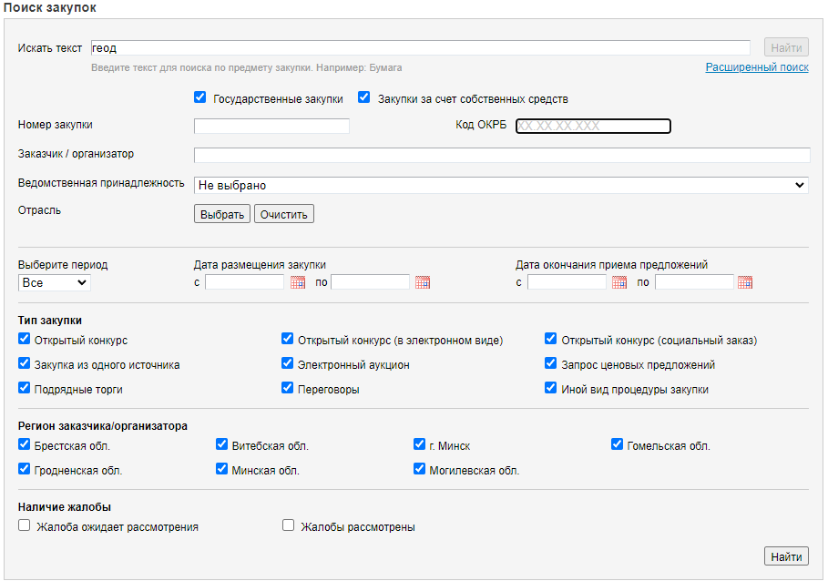

# Trade parse
Телеграм бот [@TradeParseBot](https://t.me/TradeParseBot) для оповещения о появлении новых тендеров на icetrade.by

Бот извлекает данные со [страницы сайта](https://icetrade.by/search/auctions?search_text=%D0%B3%D0%B5%D0%BE%D0%B4&zakup_type%5B1%5D=1&zakup_type%5B2%5D=1&auc_num=&okrb=&company_title=&establishment=0&industries=&period=&created_from=&created_to=&request_end_from=&request_end_to=&t%5BTrade%5D=1&t%5BeTrade%5D=1&t%5BsocialOrder%5D=1&t%5BsingleSource%5D=1&t%5BAuction%5D=1&t%5BRequest%5D=1&t%5BcontractingTrades%5D=1&t%5Bnegotiations%5D=1&t%5BOther%5D=1&r%5B1%5D=1&r%5B2%5D=2&r%5B7%5D=7&r%5B3%5D=3&r%5B4%5D=4&r%5B6%5D=6&r%5B5%5D=5&sort=num%3Adesc&sbm=1&onPage=100) 
icetrade.by с заданным интервалом времени.



## Команды бота

`/start` - При запуске бота по команде, в базу данных бота записывается id пользователя, 
для дальнейшей рассылки результатов поиска новых закупок.

`/parse` - Команда принудительного парсинга требуется при немедленной необходимости получения свежих результатов.

## Файл конфигурации `config.ini`

```ini
[GENERAL]
# URL страницы для парсинга
url = https://icetrade.by/search/auctions?...
# Интервал парсинга страницы (в минутах)
interval = 30

[ENV]
# Имя переменной окружения с токеном бота
env_token = Token

[DB]
# Путь до файла результатов парсинга
json_db_path = data/previous_data.json
# Путь до файла с id пользователей
txt_users_db_path = data/users.txt
```

## Логирование

Логи отображаются в терминале, с которого запущен бот. Логи ошибок (`level = ERROR`) записываются в файл 
`data/errors.log` с ротацией в 1 неделю.

На данный момент логируются:
* Действия пользователей
* Автоматическая проверка страницы сайта на наличие новых закупок
* Программные ошибки
